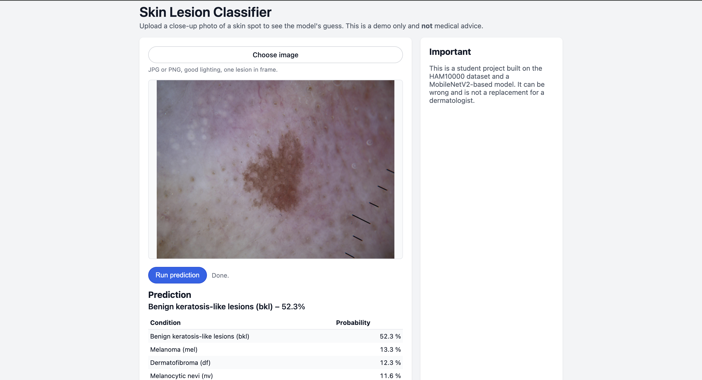

# Skin disease classification web app

A DL web application project to classify a skin lesion.Used MobileNetV2 model and trained model based on HAM10000 dataset.(about 10k images).

## Features

**Deep learning model** : MobileNetV2 model classifier trained on 10,015 skin lesion images
**Web application** : exported tensorflow.keras from notebook ansd converted it to tensorflow.js for browser-based application
**7-category classification** : Identifies different types of skin lesions including melanoma, basal cell carcinoma, and more
**Real-time Prediction** : Upload an image and get instant predictions with probability scores for each type of lesions.

## Setup
 ### for users who just want to run the web app without training the model :
      1.First download the pre-trained model
      2.Place model files into "web_model" folder
      3.Start a local server : python3 -m http.server 8000
      4.Open 'http://localhost:8000/web/' in your brawser
 ### for developers who want to train the model
      1.Install Dependencies :: pip/pip3 install -r requirements.txt
      2.Download HAM10000 dataset from Kaggle (https://www.kaggle.com/datasets/kmader/skin-cancer-mnist-ham10000) , and do not forget to extract that zip files.
      3. open and run the notebook
      4. export model (happens automatically inthe last cell)
      5. run the model (see above)

## Use the App

1. Wait for the model to load (you'll see "Model loaded. Choose an image.")
2. Click "Choose image" and select a skin lesion photo
3. Click "Run prediction"
4. View the results showing the predicted condition and probabilities for all classes

## Model Details

**Input Size** : 224x224 RGB images
**Classes** : 7 skin lesion types
  - Actinic keratoses
  - Basal cell carcinoma
  - Benign keratosis-like lesions
  - Dermatofibroma
  - Melanoma
  - Melanocytic nevi
  - Vascular lesions
**Dataset** : HAM10000 (10,015 images)
**Training** : 25 epochs with data augmentation, early stopping, and learning rate reduction(1hour)
**Accuracy** : approx. 64.6%

## Tech

**Backend/Model** :  TensorFlow/Keras (Python)
**Frontend** : Vanilla JavaScript, TensorFlow.js
**Model Export** : TensorFlow.js converter
**Data Processing** : Pandas, scikit-image, scikit-learn

## Demo

**DISCLAIMER**: This is a student project and is **NOT intended for medical diagnosis**. The model may produce incorrect predictions. Always consult a qualified dermatologist for actual medical concerns. This project is for educational and demonstration purposes only.
